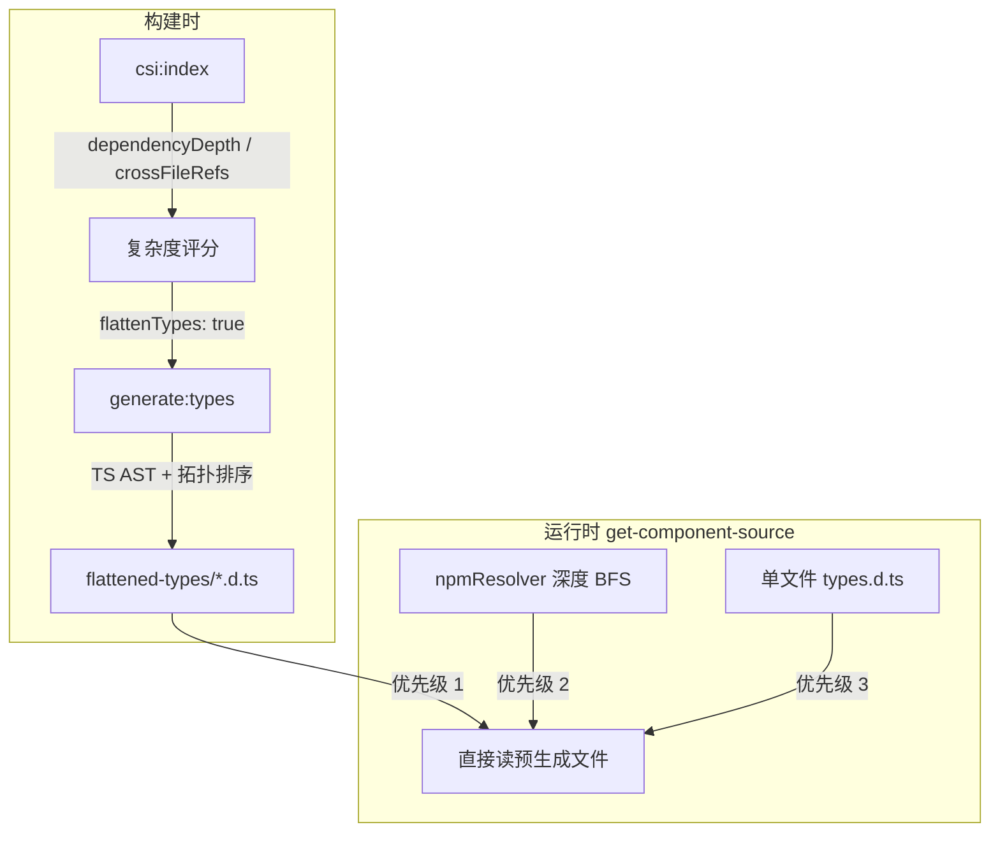

# 类型依赖与 import 链追踪

> 说明 CSI 在**构建时**和**运行时**如何发现、遍历、合并 npm 包 `.d.ts` 中的跨文件类型引用链。

## 1. 为什么要追踪 import 链

闭源组件库的类型声明通常分散在多个文件里。以 `ProForm` 为例，AI 若只读到 `types.d.ts` 里的 `ProFormProps`，可能看不到：

```
ProFormProps
  └── pageHeaderProps?: PageHeaderProps
        └── actions?: React.ReactNode   ← 在 DetailAreaProps 里定义
```

如果只给 Agent 入口文件，它会在 Props 嵌套处「断链」，进而**猜 API** 或漏掉关键字段。CSI 因此需要把 **同包内的相对 import 链** 静态展开，合并成 AI 可一次读尽的类型文档。

---

## 2. 整体流程：三处用到 import 链



| 阶段 | 脚本 / 模块 | 目的 | 精度 |
|------|-------------|------|------|
| 索引评估 | `csi-indexer.mts` | 估算引用深度，建议是否 `flattenTypes` | 正则 + 目录遍历 |
| 构建合并 | `generate-flattened-types.mts` | 生成单文件扁平化类型 | **TypeScript Compiler API** |
| 运行时回退 | `@csi/core` → `npmResolver` | 未预生成时的按需 BFS | 正则 + 文件路径猜测 |

---

## 3. 构建时：CSI Indexer 如何「量」引用链

`pnpm csi:index` 在提取每个组件的 Props 后，会计算两个与 import 相关的指标：

### 3.1 `crossFileRefs` — 入口文件有多少跨文件 import

扫描 `types.d.ts`，用正则统计 import 语句数量：

```typescript
// csi-indexer.mts — countCrossFileRefs
const importMatches = content.match(/import\s+.*from\s+['"][^'"]+['"]/g);
return importMatches?.length ?? 0;
```

含义：入口类型文件「直接指向」几个外部文件。数量越大，越可能需要扁平化。

### 3.2 `dependencyDepth` — 相对路径 import 的最大深度

从组件目录的 `types.d.ts` 出发，**只跟踪以 `.` 开头的相对 import**，在包根目录内递归：

```typescript
// csi-indexer.mts — countDependencyDepth（简化）
const importRegex = /from\s+['"](\.[^'"]+)['"]/g;
// 解析为目录 → 继续读 types.d.ts → 深度 +1
// 上限 maxDepth = 5，visited 防环
```

示例（概念）：

```
pro-form/types.d.ts          depth 0
  → ../page-header/types.d.ts   depth 1
      → ./detail-area/types.d.ts   depth 2
```

`dependencyDepth = 2`。

### 3.3 如何决定 `flattenTypes`

上述指标进入**复杂度评分**（与 Props 数量、子组件、静态成员等加权）：

```
total = props×1 + required×0.5 + depDepth×3 + static×10 + subComponents×8 + crossRefs×2
```

| total | level | contextLevel | flattenTypes |
|-------|-------|--------------|--------------|
| > 30 | complex | full-example | **true** |
| > 15 | moderate | types-with-brief-example | false |
| ≤ 15 | simple | types-only | false |

`csi:sync` 合并时，手动在 `registry.json` 里设置的 `flattenTypes` **优先于** CSI 建议。

---

## 4. 构建时：扁平化生成器如何「走」import 链

`pnpm generate:types` 只对 `registry.json` 里 `flattenTypes: true` 的组件执行。这是整个 CSI 里**最精确**的 import 链追踪。

### 4.1 找入口文件

`findEntryFiles()` 可能得到 **多个入口**：

1. `registry.typesPath` 模板解析出的 `types.d.ts`（如 `typings/components/{component}/types.d.ts`）
2. 自动探测的组件主声明 `{component}.d.ts`（含 `CompType`、静态方法、子组件如 `ProForm.BasicForm`）

多入口很重要：高阶组件的「API 面」有时拆在 `types.d.ts` 和 `pro-form.d.ts` 两个文件。

### 4.2 收集依赖图（BFS + TS 模块解析）

核心函数：`collectDependencyGraph(entryFiles, packageRoot, compilerOptions)`

```
入口文件入队
  ↓
对每个 .d.ts 用 ts.createSourceFile 解析 AST
  ↓
遍历顶层 import / export-from 节点
  ↓
ts.resolveModuleName() 解析模块 → 绝对路径
  ↓
  ├─ 路径在 packageRoot 内 → 内部依赖，加入 graph，继续 BFS
  └─ 路径在外部（react、dayjs 等）→ 记入 externalImports，不再展开
```

支持的语句形态：

| 语法 | 处理 |
|------|------|
| `import type { X } from './path'` | 解析 `./path` → 入队 |
| `import { X } from './path'` | 同上 |
| `import type * as X from '...'` | 记录外部符号 |
| `export * from './path'` | 同 import，继续 BFS |
| `export { X } from './path'` | 同上 |

**与 Indexer 的区别**：这里用 `typescript.resolveModuleName`，能正确处理 `index.d.ts`、路径别名、`/types` 后缀等；Indexer 的 `countDependencyDepth` 只做相对路径 + `types.d.ts` 启发式，用于**快速打分**而非最终合并。

### 4.3 拓扑排序

`topologicalSort()` 对依赖图做 DFS 拓扑序：**被依赖的文件排在前面**，入口排在后面。遇到环（A→B→A）时 `inStack` 跳过，避免死循环。

### 4.4 提取声明并分层输出

对每个排序后的文件，`extractTypeDeclarations()` 用 AST 提取：

- `interface` / `type` / `enum` / `class` / `declare const` 等
- **跳过** `import` 和 `export ... from`（依赖已内联，不再保留 re-export 语句）
- 保留 JSDoc（`getNodeTextWithJSDoc` 取 `getFullStart()` 到 `getEnd()`）

输出分为三层，方便 AI 阅读和运行时截断：

```
┌─────────────────────────────────────┐
│ External dependencies               │  react / dayjs 等 import type
├─────────────────────────────────────┤
│ 核心类型（入口文件）                  │  ProFormProps, CompType ...
├─────────────────────────────────────┤
│ 一级依赖（入口直接 import）           │  PageHeaderProps, FieldType ...
├─────────────────────────────────────┤
│ 深层依赖（间接引用）                  │  DetailAreaProps, ...
└─────────────────────────────────────┘
```

产物路径：`data/flattened-types/<library>/<Component>.d.ts`

---

## 5. 运行时：未扁平化时的 BFS 回退

若组件未标记 `flattenTypes`，或扁平化文件缺失，`@csi/core` 的 `resolveTypes()` 走 **运行时深度解析**：

```
优先级 1: flattened-types/<lib>/<Component>.d.ts
优先级 2: deepResolveTypes(primaryFile)   ← 本节
优先级 3: 单文件读取（简单组件）
```

`deepResolveTypes` 实现（`packages/core/src/resolvers/index.ts`）：

1. 从 `types.d.ts` 主文件 BFS 出队
2. 用**正则**提取 `import/export from './relative'`
3. 猜测磁盘路径：`.d.ts` / `.ts` / `/index.d.ts`
4. **只展开相对路径**；`react`、`history` 等包名 import 跳过
5. 限制：`maxDepth=3`，`maxFiles=30`，`maxTotalSize=100KB`

多文件结果用注释标注来源：

```typescript
// ========== typings/components/pro-form/types.d.ts (primary) ==========
...

// ========== ref: typings/components/page-header/types.d.ts ==========
...
```

与构建时扁平化相比：运行时方案**更快部署、无需预生成**，但精度较低（正则 vs TS API），且可能截断；因此高阶组件推荐构建时扁平化。

---

## 6. 两种 BFS 对比

| | CSI Indexer 评估 | generate:types 扁平化 | 运行时 deepResolve |
|--|------------------|----------------------|-------------------|
| **时机** | `csi:index` | `generate:types` | `get-component-source` |
| **解析方式** | 正则 + 目录启发 | TS Compiler API | 正则 |
| **模块解析** | 手动 resolve 目录 | `ts.resolveModuleName` | 路径候选列表 |
| **输出** | 数字指标 | 单文件合并 .d.ts | 拼接多文件原文 |
| **外部包** | 不展开 | 保留 import type | 不展开 |
| **深度限制** | 5（评估用） | 无（全图） | 3 |
| **典型用途** | 决定是否 flatten | ProTable / ProForm | Button 等简单组件 |

---

## 7. 配置与调试

### 7.1 手动开启扁平化

在 `registry.json` 中为组件设置：

```json
"ProTable": {
  "contextLevel": "full-example",
  "flattenTypes": true
}
```

然后：

```bash
pnpm generate:types
pnpm verify:resolver
```

### 7.2 验证引用链是否完整

`verify-resolver.mts` 对 ProForm 类组件会检查合并结果是否包含 `DetailAreaProps`、`actions?: React.ReactNode` 等跨文件符号。

也可直接查看生成物：

```bash
less data/flattened-types/react-pro-components/ProForm.d.ts
# 搜索「一级依赖」「深层依赖」分段注释
```

### 7.3 常见问题

| 现象 | 可能原因 |
|------|----------|
| 扁平化文件为空 | 入口路径 `typesPath` 与 npm 包实际目录不一致 |
| 缺少 CompType / 子组件 | 未探测到 `{component}.d.ts` 第二入口 |
| 运行时缺类型、构建时有 | 未跑 `generate:types` 或 `flattenTypes` 未开启 |
| 深层类型被截断 | 运行时 100KB 上限；应改用扁平化产物 |

---

## 8. 相关源码

| 文件 | 职责 |
|------|------|
| `scripts/csi-indexer.mts` | `countCrossFileRefs`、`countDependencyDepth`、`scoreComplexity` |
| `scripts/generate-flattened-types.mts` | `collectDependencyGraph`、`topologicalSort`、`flattenComponentTypes` |
| `packages/core/src/resolvers/index.ts` | `deepResolveTypes`、`resolveTypes` 优先级链 |
| `docs/architecture.md` §5.2 | 运行时类型解析优先级总览 |

---

## 9. 小结

CSI 对 import 链的处理是**分层设计**：

1. **Indexer** 用轻量正则快速度量「这个组件类型有多散」，决定是否建议扁平化；
2. **generate:types** 用 TypeScript 官方模块解析 + AST 提取，在构建时把同包依赖链**合并成单文件**，并按「核心 → 一级 → 深层」排布，优化 AI 阅读与截断策略；
3. **运行时 BFS** 作为兜底，用有界正则遍历，适合简单组件或未预生成的场景。

三者配合，使闭源组件库在**不暴露源码**的前提下，仍能让 Agent 拿到足够完整、可验证的 Props 类型链。
